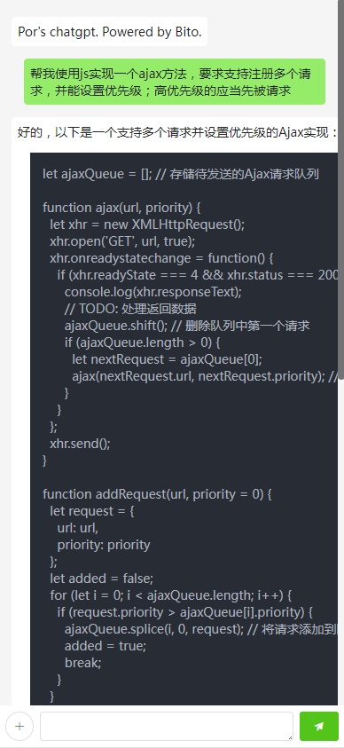
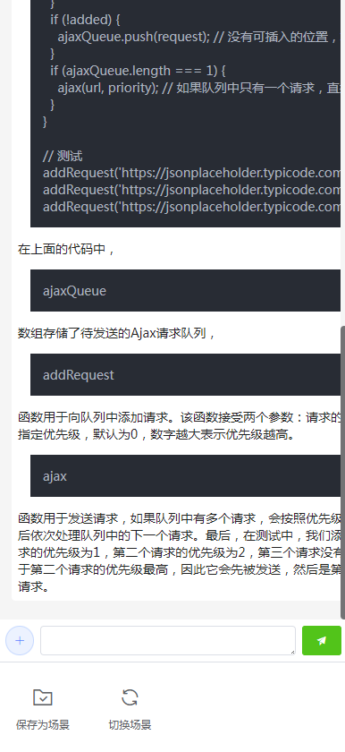
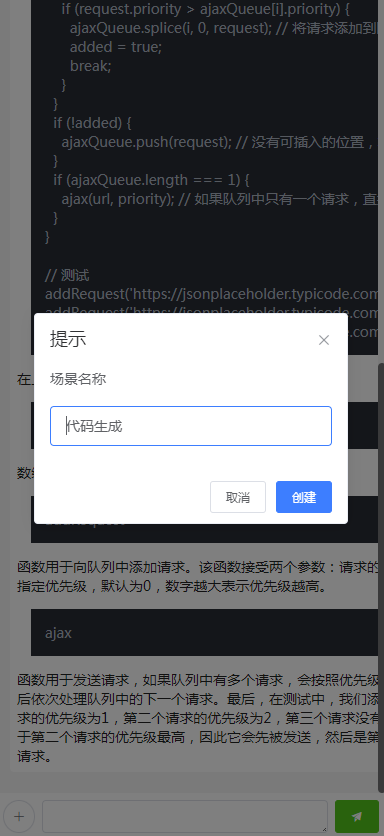
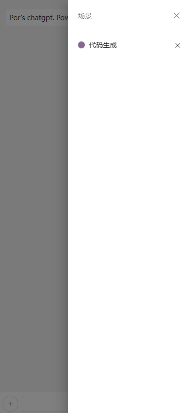

# por-chatgpt

提供chatgpt的ui界面，使用第三方接口

## 主要功能

基于 `chatgpt4.0` 的提问及回答

支持返回的结果中保函：代码、列表、表格、图片

### 辅助功能

点击左下角“+”按钮触发菜单

### 保存为场景 & 切换场景

即将包含 `一系列问答` 的场景进行保存，并切换回某场景

>该功能仅将数据保存在浏览器中，不上传至服务器

